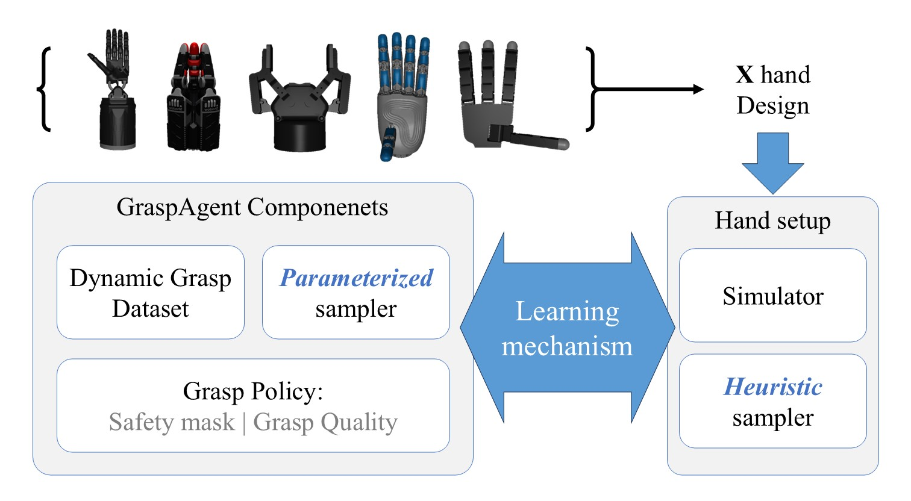
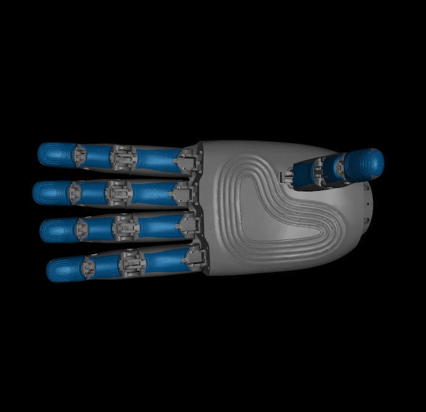
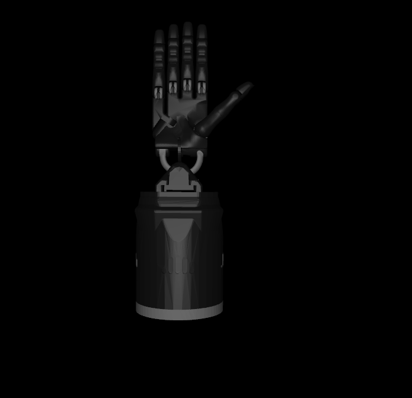
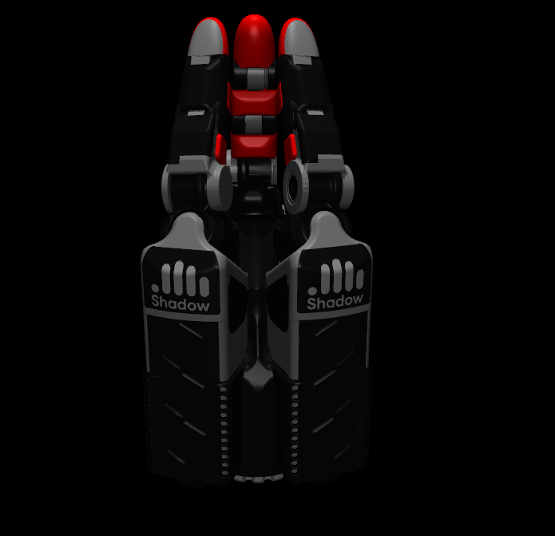
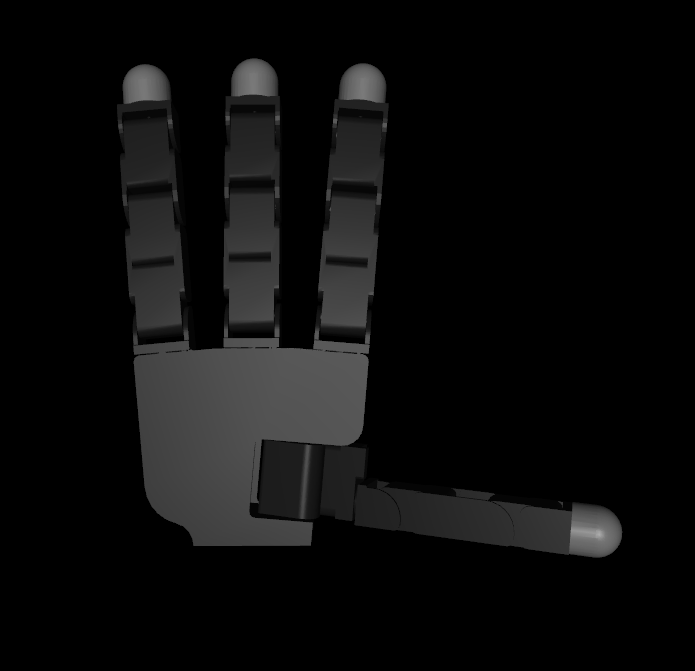
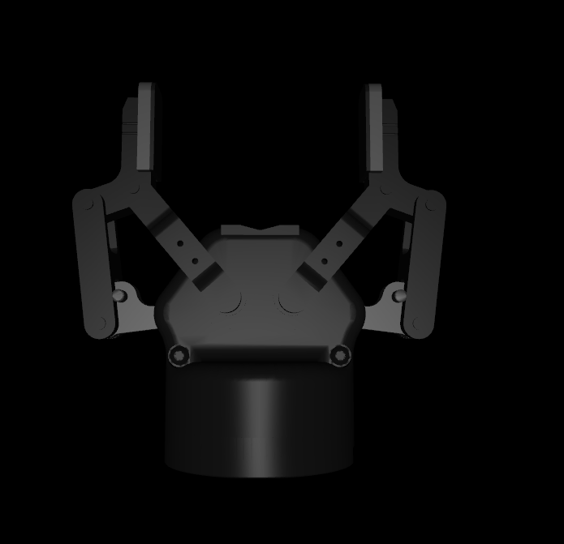

# GraspAgent_AnyHand
This repository is under construction. 
This work is a result of intensive experiments conducted by Taqiaden during his work at Chinese Academy of Science Institute of Automation. If you have any question please do not hesitate to contact me: taqiaden@gmail.com, Whastapp: 00967 774 631 499, Wechat: taqiaden

<p align="center">
    <a href='https://paper'>
      
    </a>
    <a href='https://dataset'>
      
    </a>
</p>

<div align="center">
  
</div>

## Grasp preformance
| Hand                 | ShadowHand 5F | ShadowHand 3F | CasiaHand | Allegro hand | Robotiq 2F85 |
|----------------------|---------------|---------------|-----------|--------------|--------------|
| Average success rate |               |               | 91%       |              | 96%          |
| 
## Installation
### Prerequisites
The following pakages version are used during the development of this repository:
```
python=3.10.16
torch=2.5.1
open3d=0.18.0
cuda=12.6

```

## Test mode
To test each hand and view the result in Mujoco set test_mode argument to True for each hand script in Folder named "training"

## Hands

### CasiaHand:
<div align="center">
  
</div>

### ShadowHand five fingers
<div align="center">
  
</div>

### ShadowHand three fingers
<div align="center">
  
</div>

### Allegro
<div align="center">
  
</div>

### Robotiq 3f85
<div align="center">
  
</div>

## Hand designs
Except for CasiaHand which was designed in our Lab, all hands are brought from the open source repository [mujoco_menagerie](https://github.com/google-deepmind/mujoco_menagerie) with modification applied to each hand including changing the reference point and adding a mocap body.


## Final notes
Objects used in Mujoco simulator are pre-processed using the Collision-Aware Approximate Convex Decomposition (CoACD) method. The processing method is available [here](./sim_dexee/utils/generate_mesh_xml.py)